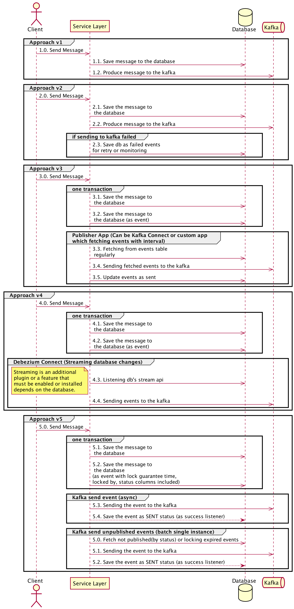

# Kafka event processing (publishing and consuming) #

Approaches for handling events:



Debezium implementation:
```shell
$ make set-up
$ make krm-up
$ make krm-add-connector-request
$ make krm-send-email-request
$ make krm-down
```

Credits:

- [Reliable Messaging Without Distributed Transactions](https://vimeo.com/111998645)
- [Exactly Once Processing in Kafka with Java](https://www.baeldung.com/kafka-exactly-once)
- [Spring boot kafka with transactions](https://medium.com/@milo.felipe/spring-boot-kafka-transactions-97a2f653b60a)
- [Kafka transactional integration](https://medium.com/dev-genius/transactional-integration-kafka-with-database-7eb5fc270bdc)
